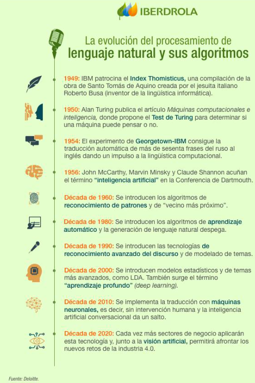

# ÉTICA Y MANEJO DE DATOS PARA DATA SCIENCE E IA

[Version en notion](https://www.notion.so/TICA-Y-MANEJO-DE-DATOS-PARA-DATA-SCIENCE-E-IA-d00b3158b8ae4247b8712ae5c82d8317) 

- INTRODUCCIÓN
    
    ¿Qué son los datos personales?: Información que permite identificar a una persona de manera directa o indirecta.
    
    clasificación de los datos personales:
    
    - Directa o indirecta. Por ejemplo, Edad, teléfono, domicilio, correo electrónico, documento nacional de identidad, número de seguridad social, ingresos, fecha de nacimiento. Directo es que nadie más lo va a tener
    - Por su jerarquía de riesgo/importancia:
        1. Datos personales ordinarios: 
            - Ejemplo: nombre, dirección, finanzas, personales.
        2. Datos personales sensibles: debemos tener un rigor especial a la hora de preservarlos y una justificación adicional para mostrar el uso que le vamos a dar a este tipo de información
            - Ejemplo: origen étnico, opiniones políticas y religiosas, orientación sexual.
        3. Datos especiales: de otro tipo de procesamiento. 
            - Genéticos
            - Biométricos: son un tipo de datos personales. Permiten identificar digitalmente a una persona.
                - Ejemplos: reconocimiento facial, de retina, vascular, de firma, de escritura, de voz, de escritura de teclado.
            - Salud
    
    Datos NO personales: 
    
    - Información anonimizada. Si está anonimizada ya está protegida, por lo que podemos sacar un análisis de una manera más clara.
    - Datos de personas jurídicas, es decir, de una institución.
    - Información que no permita la identificación.
    
    Clasificación de los datos biométricos:
    
    - Por naturaleza:
        - Universal: compartimos con otras personas. Por ejemplo, mi grupo sanguineo.
        - Único: por ejemplo, un análisis clínico.
        - Permanente: no cambia. Por ejemplo, la huella dactilar.
    - Según sus características:
        - Rasgos físicos y fisiológicos: podemos observar a simple vista, por ejemplo, alto, delgado, bajo.
        - Rasgos de comportamiento y personalidad: tenemos que conocer a la persona. Por ejemplo, alegre, triste, feliz.
    
    interés creciente por la información: las empresas tienen más interés por los datos.
    
    - Recolectar información es cada vez más económico.
    - Las empresas entienden el valor de entender a su usuario.
    - Hay un alto incentivo para almacenrar información, pero tiene que regularse su uso.
    - Algunas empresas se dedican a la compra y venta de bases de datos.
    
    Regulación de uso: se entiende como el volumen máximo de información que tiene que tener una empresa, qué tipo de información tiene que recolectar y explicar por qué van a recolectar los datos.
    
    Fenómenos que se deben evitar al hacer análisis de datos:
    
    - Bias (sesgo): Sucede cuando seleccionamos la información de manera errónea y considerando una muestra que no representa la totalidad de la población. En este caso, la uestra aleatoria no es representativa. Ejemplo: sesgo racial en el reconocimiento facial.
    - GIGO (Garbage in, garbage out): la calidad del resultado (output) depende de la calidad de la entrada (input).
    
    Advertencias de uso en marketing: Las empresas cada vez más usan la información para hacer campañas personalizadas. Podemos crear publicidad personalizada, sin embargo, este uso de información se debe hacer con algunas advertencias:
    
    - Evitar sesgos discriminatorios.
    - Evitar el uso de precios manipulados o precios diferentes en función de la población.
    - Manipulación de campañas políticas.
    - evitar el fomento de conductas adictivas y ataques emocionales.
    
    Advertencias de uso en campañas políticas: el escándalo de Cambridge Analytica.
    
    Cambridge Analytica ofrecía a negocios y partidos políticos la posibilidad de cambiar/manipular el comportamiento de la audiencia.
    
    1. Datos propios a partir de encuestas
    2. Datos de redes como Facebook
    3. Ciencia del comportamiento y modelos predictivos.
    
    Se identificaron personas que podían ser targets de campañas de marketing para incidir en sus preferencias políticas. Por ejemplo, campañas como Donald Trump en EE.UU o PRI en méxico.
    
    Reglamentos: para penalizar y regular el uso de datos.
    
    - Ley federal de prottección de datos personales en posesión de particulares.
        - En México se aplica la ley contra las empresas que no protejan la información de sus clientes de manera adecuada.
        - Dato personal: información que permite identificar a una persona.
        - Obliga a las empresas a informar del uso que le darán a la información recolectada.
        - Sanciona la compra de bases de datos personales.
    - Reglamento General de Protección de Datos (GDPR): la ley de la Unión Europea regula la protección de datos y su privacidad para todos los ciudadanos de la UE y de la AEE así como la transferenciade datos fuer de la región.
        - Pretende dar control a los ciudadanos sobre sus propios datos y simplificar el entorno regulatorio.
        - La ley aplica pra cualquier empresa del mundo que procese datos de personas residentes en la UE.
    
- ÉTICA Y DEEP LEARNING
    
    Vehículos autónomos: hace un reconocimiento de las imágenes que tiene al frente, por lo que tiene 2 opciones: seguir derecho y parar. Como es código binario, los dilemas éticos detrás de esto han impedido que tengamos esa clase de tecnología en las calles (es fácil de corromper); pero los datos muestran que esta tecnología es más segura que la capacidad humana.
    
    Reconocimiento facial: Se basa en datos biométricos. Se basa en el reconocimiento de vectores donde identifica los rasgos de una persona única. Esta tecnología facilita el acceso, pero hay que tener en cuenta qué es lo que estamos dando, por lo que el usuario debe decidir a quien darle permiso y a quien no.
    
    Ética en la pandemia: Algunos gobiernos han sido más restrictivos que otros en varios temas, por ejemplo:
    
    - Los controles de acceso.
    - Acceso a espacios físicos.
    - Cuarentenas.
    - Reportes de casos de COVID
    
    Ética en las relaciones interpersonales: Posteriormente a la pandemia nos hemos acostumbrados a usar aplicaciones como zoom para comunicarnos con las demás personas; pero también han enfriado nuestras relaciones interpersonales.
    
    Otro tipo de interacción interpersonal son aplicaciones como Boomble y Tinder, ya que las personas estamos motivados por el hecho de no tener que ver a tantas personas sino que podamos elegir rasgos físicos, prefrencias, etc; pero también estamos filtrando nuestra información. 
    
    También tenemos que hablar acerca de las funciones de audio: nosotros estamos otorgando el acceso al micrófono, entonces también puede tener acceso a lo que decimos. 
    
    Y, ¿Qué hacemos con las redes sociales después de la vida?: ahora ya podemos decidir un heredero, que es la persona que será responsable de o bien eliminar tus redes sociales o mantenerlas.
    
    Procesamiento del Lenguaje Natural (NLP): El procesamiento del lenguaje natural, en inglés NLP o Natural Language Processing, es la interacción entre las computadoras y el lenguaje humano a partir de lenguas naturales. Por ejemplo, Chatbots (esta alternativa ofrece la posibilidad de que no tengas límite horario para establecer comunicación con las empresas.)
    
    Reto de Alibaba, Standford y Microsoft: Este experimento dio lugar a un dilema ético porque puso en especial relevancia esta capacidad de la máquina frente a los humanos. Sin embargo, todavía hay partes en las que el ser humano tiene una gran ventaja sobre las máquinas, como por ejemplo la parte de la identidad y las emociones. Todavía no se ha logrado que los chatbot tengan una identidad y que se identifiquen con la marca. 
    
    Qué es la tecnología GPT-3: La tecnología GPT-3 es un lenguaje autorregresivo que emplea el aprendizaje profundo (deep learning) para producir textos que simulan la redacción humana. Esta tecnología toma datos de un histórico y a partir de estos desarrolla un aprendizaje profundo o deep learning para entender lo que dicen los textos que se encuentran en la red. También plantea un tipo de modelo con un dilema sobre si la máquina estaría mejorando la inteligencia y capacidades humanas. Por ejemplo, podríamos poner a competir este lenguaje con el conocimiento de un notario, así si alguien pide una escritura esta aparezca de una manera automatizada. También podría reemplazar la labor de un médico al poder responder con base a toda la información que ha leído en la infinidad de documentos médicos disponibles en la red.
    
    
    
- POLÍTICAS PÚBLICAS - DATA FOR GOOD
    
    Las políticas públicas es aquella atención del Estado a una necesidad social. Manuel Tamayo de la Universidad Complutense de Madrid señala que “Las políticas públicas son el conjunto de objetivos, decisiones y acciones que lleva a cabo un gobierno para solucionar los problemas que en un momento determinado los ciudadanos y el propio gobierno consideran prioritarios”.
    
    Hay varias maneras de implementación:
    
    - Normas
    - Instituciones
    - Prestaciones y servicios. Por ejemplo, el alumbrado.
    
    Este tipo de políticas públicas ayudan a alcanzar principios éticos e igualdad de derechos.
    
    Objetivos de las políticas públicas: 
    
    - Atender desde el Estado los problemas de los ciudadanos.
    - Implementar a partir de normas, instituciones, prestaciones y servicios. Esto involucra toda acción para reparar una calle, creación de alumbrado, etc.
    - Ayudar a alcanzar principios éticos y a crear igualdad en las sociedades.
    
    Tipología de las políticas públicas:
    
    - Autoridad institucional (municipal, nacional, mundial,…). Por ejemplo, creación de semáforos.
    - según el sector (educación, medio ambiente…).
    - Según los destinatarios (personas con discapacidades, jóvenes,…)
    - Según la elaboración (participativa o autoritaria)
    - Según la planificación (anticipativa o reactiva). Por ejemplo, cómo reacciono ante la pandemia es una planificación reactiva.
    
    Data for Good se refiere a todo lo que involucra datos abiertos. Estos son los que se comparten con la comunidad y expertos como tú pueden empezar a procesarlos para predecir eventos.
    
    Los datos tienen dos caras pues:
    
    - Nos encontramos los **dilemas éticos** que se derivan de su recolección y uso
    - Es indiscutible que los datos también pueden crear oportunidades y grandes **beneficios para la sociedad**.
    
    Uso de datos con fines sociales:
    
    - Prevención de crímenes, con el uso de cámaras de seguridad, mapas de calor
    - Seguridad financiera
    
    Datos y salud: la información puede ayudar a predecir eventos que representan oportunidades importantes para la sociedad. Por ejemplo, el Apple Watch:
    
    - Conserva en memoria un histórico de datos que permite emitir alertas con estados clínicos diferentes
    - Puede salvar la vida de las personas al detectar a tiempo anomalías
    - Envía notificaciones a contactos de emergencia
    - Conserva en memoria un histórico de datos que permite emitir alertas cuando la persona que lo lleva presenta cualquier cuadro clínico diferente a los parámetros normales.
    
    Gracias a la recolección de datos se sabe con meridiana certeza cómo evoluciona una enfermedad, posible curso que puede tomar, tasa de éxito de determinados tratamientos, índices de mortalidad, tiempo promedio de incubación, desarrollo y muerte de un virus, entre otros beneficios.
    
    Datos y movilidad: El sistema de transporte en una ciudad en cualquier lugar del mundo puede dividirse en dos tipos de vehículos:
    
    - Vehículos motorizados
    - Vehículos libres (bicicletas, scooters, patines, motocicletas)
    
    ECOBICI: es un sistema de bicis públicas implementado en ciudad de mexico y Argentina. Con este se puede:
    
    1. Trazan rutas de viaje.
    2. Permiten consultar el mapa con todas las ciclo-estaciones del sistema.
    3. Muestran el mapa de ciclovías de la Ciudad de México, así como de las estaciones de Metro
    4. Generan reportes de incidencias sobre bicicletas, estaciones y/o el servicio.
    5. Permiten consultar el histórico de usos a través de una cuenta de usuario.
    
    La aplicación utiliza servicios de localización en segundo plano para guardar las rutas. También este tipo de empresas facilitan la movilidad y también recolectan información porque toda bici está conectada a radar que suministra información detallada de su geolocalización.
    
    Los datos recolectados ayudan a determinar el flujo de la ciudad y concentración de bicicletas, lo cual contribuye a la creación de políticas públicas. Además, aporta información sobre las calles que no poseen ciclovías o donde suceden mayor cantidad de accidentes, etc.
    
    Qué son las ciudades inteligentes: o smart cities son lugares más sustentables y ecológicos que emplean los datos para el desarrollo de tecnologías en beneficio de los ciudadanos.
    
    - Cuenta con redes inteligentes de transporte urbano, instalaciones mejoradas para el suministro de agua y la eliminación de la basura
    - Goza de un órgano administrativo para que la ciudad sea más interactiva y receptiva
    - Utiliza las tecnologías de la información y la comunicación (TIC) para mejorar la calidad de la vida de los y las habitantes, la eficiencia y la competitividad.
    
    Las principales ciudades inteligentes del mundo son: Singapur, París, Tokio, Seúl, Toronto, Hong Kong, Ámsterdan, Londres, Chicago, Nueva York.
    
    Datos y educación: Las escuelas online como Platzi realizan el monitoreo y evaluación de datos para conocer a las personas y hacer recomendaciones en función de esta información.
    
    En el caso de que una persona reciba una sugerencia, esta es el resultado de algoritmos de recomendación que han recolectado información sobre los comportamiento de estudiantes.
    
    Datos y medio ambiente: Por ejemplo, la polución en el aire se puede medir a partir de detectores y sensores que emiten alertas públicas y los gobiernos se ocupan de hacerlas llegar a la ciudadanía. Otro ejemplo es la recolección de información para determinar las condiciones del subsuelo, frutos y hojas de los cultivos para prevenir enfermedades o evitar el uso inadecuado de fertilizantes, entre otros.